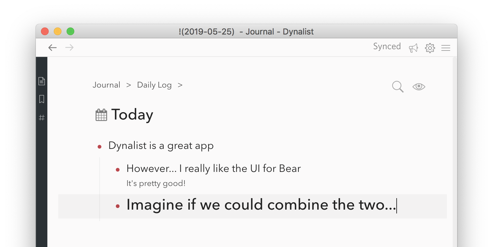

# dynalist-bear-theme

I've created this for myself, attempting to adapt the colors & design of the default Bear theme (Slate) for Dynalist.

You can use this CSS by becoming a pro dynalist user, going into settings, going into the Dynalist Pro tab, finding the CSS box, and pasting the CSS from main.css directly in.

I've mostly have done for myself, but I've love to take pull requests. 

I think it works well, but consider it a work in progress for the time being.